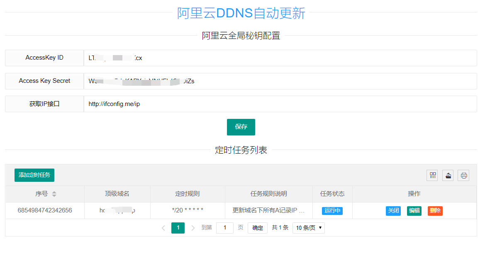

# AliYunDns
阿里云DDNS定时更新Golang版。
golang交叉编译跨平台可执行程序，一键运行，部署使用方便。已提供windows，linux，mac系统64位可执行程序，见release。


## 技术引入
1. 后端golang框架：goframe   
2. 后端数据库sqlite  
3. 前端：layui jquery  

## 参考文档
1. https://developer.aliyun.com/sdk?spm=a2c4g.11186623.2.16.30bc30b1I2tKHI  
2. https://goframe.org/index 	
3. https://www.layui.com/demo/table/data.html

## 功能列表
1. 阿里云域名管理配置秘钥管理
2. 添加顶级域名，定时更新域名下所有A记录IP地址
3. 提供界面操作，支持定时任务添加删除删除
4. 提供界面操作，支持启动或者关闭任务 
5. 系统重启任务不丢失，自动加载已配置任务列表    
6. 配置参数热更新

## 图形界面
   管理首页<br/>
   管理定时任务<br/>
   系统启动日志<br/>
   更新A记录IP日志<br/>

## TODO 列表
1. todo:目前用domain管理即可，因为一个domain下只有一个任务,后续扩展出新场景，用id管理   
2. todo:添加更多的任务场景
3. todo:用正则验证 abc.xyz corn
4. todo:定时任务执行日志界面,基于日志任务重试


## 常用命令
1. 项目下载依赖   
go mod download
go mod vendor   (idea识别;交叉编译使用.)
2. 资源文件打包  
资源目录打包data.go  
gf pack config,public,template boot/data.go -n boot
3. 交叉编译
gf build main.go  
因为使用了sqlite，上面命令打包出来不可用。需要配合下面的xgo进行交叉编译

```
linux环境或windows环境下都可以，这里使用虚拟机里的centos6.5，在虚拟机里配置好git，
git ssh，docker，golang ，go mod 代理。
export GOPROXY=https://goproxy.io
```
使用xgo交叉编译：  
    2.1 项目安装依赖
    go get github.com/karalabe/xgo  
    2.2 安装docker镜像
    docker pull karalabe/xgo-latest
    2.3 mkdir -p /go/src
    把需要交叉编译的工程移到/go/src下，以后交叉编译的工程都放在该目录下
    2.4 执行下面命令
```
cd /go/src/交叉编译的项目
go mod download
go mod vendor
#进入容器
docker run -it --entrypoint /bin/bash  karalabe/xgo-latest

docker run --rm -it -v "$PWD"/runapp:/build -v "$PWD"/vendor:/go/src -v "$PWD":/go/src/AliYunDns \
-e TARGETS=windows/amd64,darwin/amd64,linux/amd64 karalabe/xgo-latest AliYunDns

#docker知识补充：
#   -v 意思： /test:/soft 本地/tect目录作为容器的/soft目录
#   -e 给容器传递变量参数 变量前是 --
#   --rm 容器退出时候清理挂在目录下内容
#   -it 进入了命令交互界面 

#交叉编译平台版本知识补充
#amd64 和 i386 是什么意思?
#   可以直接理解为amd64为64位系统，i386为32位系统.因为是amd把64位率先引进桌面系统的，英特尔也是要追随amd并且保持兼容，
#   一般在软件包里包含这样的字符。(直接一直以为amd64表示是amd处理器才能用...)
#TARGETS=windows/amd64,darwin/amd64,linux/amd64 可以简化编译，提高编译速度
#TARGETS=windows/*,darwin/*,linux/*
```